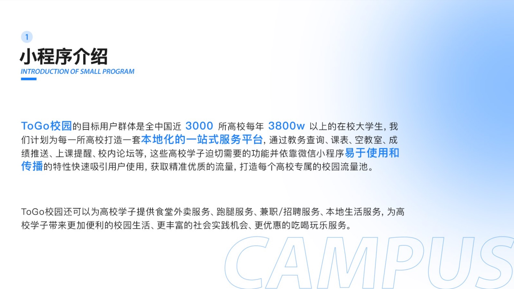
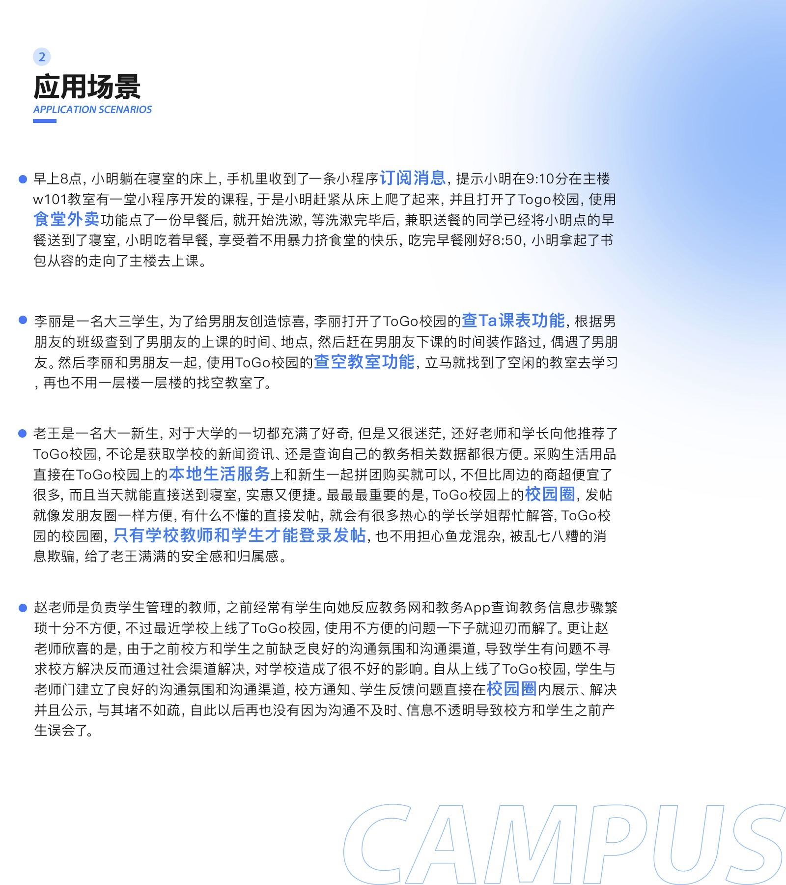
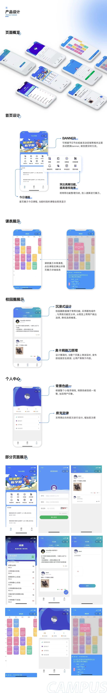
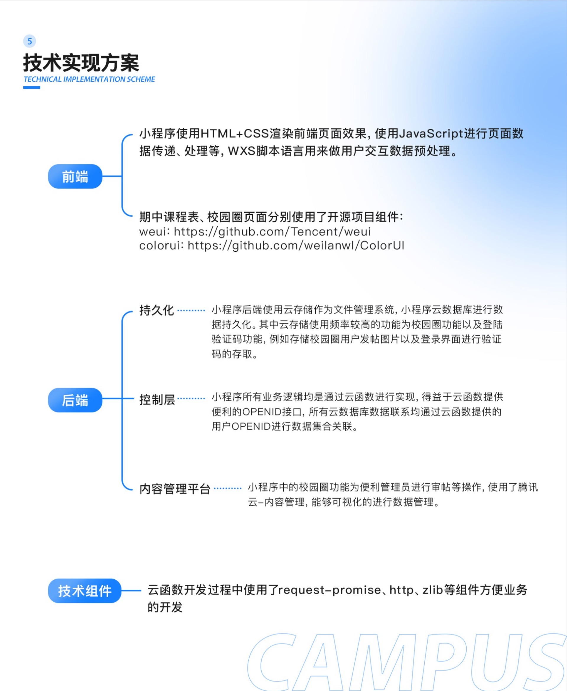

# 🏆 ToGo校园

**开源不易，右上角点个star吧～**

## 2.0开发完成
### 技术栈：React Antd SpringBoot Uniapp
### 演示视频

### 项目背景

近几年随着校园市场不断发展，校园服务行业也愈发鱼龙混杂。操作繁琐、功能单一、交互死板等,这些都是目前大部分校园服务存在的问题。

这个项目的初衷就是给同学们一个简单、方便、好用的校园小程序。目前，开源版本包含了基础的教务查询功能以及只有本校同学能使用的校园圈功能，后续也会不断开放运营版本的功能到开源项目中。

###部署

- 将代码导入微信开发者工具，点选云开发。
- 将cloudfunctions中的全部函数均进入目录后npm install。
- 上传并部署全部云函数。
- 在数据库中分别创建 comments、commentback、share、star、system、users表，最后将根目录的database_export-VQvEVynX_ZnT.json文件导入system表中。
- 将system记录中的is_wx_killer字段改为false，即可开启校园圈功能

###体验账号

u：201888888
p：1

所提供的账号为体验账号，在代码中涉及到学校教务等隐私的逻辑已经删除，但添加了详细注释希望能够为各位看官老爷们提供思路。

线上版本体验

### 联系我拿体验账号吧～。

🌈 如果你想和我们一起维护这个项目，开发出最新的功能 

🌈 如果你是学生，想和我们一起学习维护

🌈 如果你是商户，想和我们一起玩转高校市场

🌈 如果你是创业者，想和我们一起创业

🌈 如果你需要开发团队外包项目，我们是最好的乙方，联系我，三线城市人工价格，一线城市大厂退休程序员为您服务😄

🏆 那就加我微信，一起探讨更多可能吧～

⚠️【备注智慧校园】

合作交流
- 商业授权需联系我 发送【服务】获取商业授权以及其他服务内容

### Gitee : https://gitee.com/zengyunengineer/TOGO_School_Miniprograme

# 作者其他作品
[无水印 Sora 2 AI 视频生成社交站](https://sora2.cloud)
[Ricebowl AI 一站式 AI 视频图片生成平台](https://ricebowl.ai)
